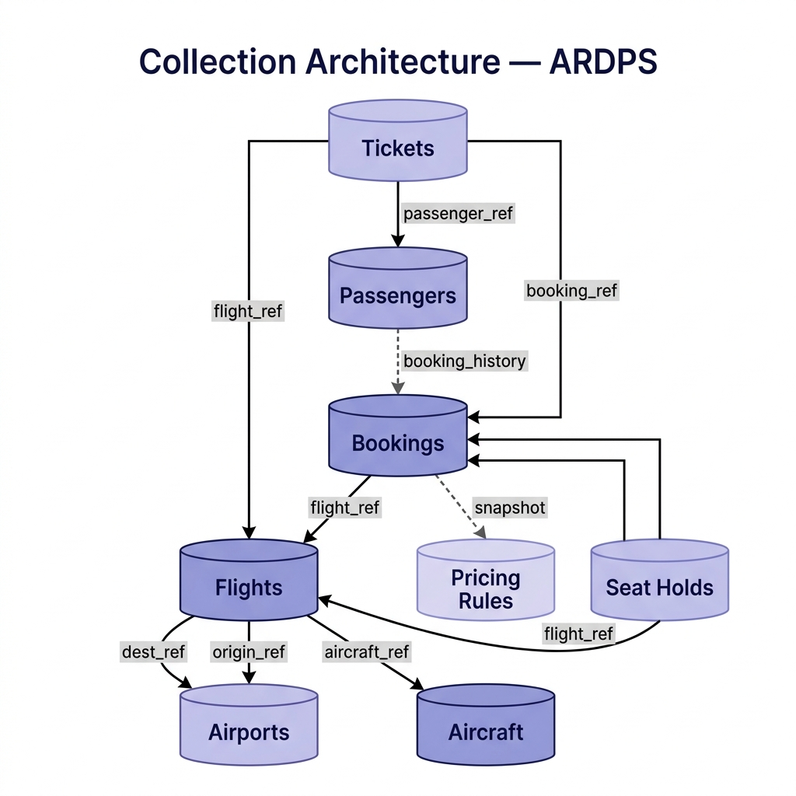

# Airline Reservation and Dynamic Pricing System (ARDPS)

<div align="center">

[](https://github.com)
[](LICENSE)
[](https://github.com)

**A comprehensive, mission-critical platform for managing airline operations with real-time seat inventory management and demand-based dynamic pricing.**

[Features](#features) • [Architecture](#architecture) • [Getting Started](#getting-started) • [API Reference](#api-reference) • [Team](#team)

</div>

---

## 📋 Table of Contents

- [Overview](#overview)
- [Features](#features)
- [Technology Stack](#technology-stack)
- [System Architecture](#system-architecture)
- [Project Structure](#project-structure)
- [Getting Started](#getting-started)
- [API Reference](#api-reference)
- [Database Schema](#database-schema)
- [Key Features Deep Dive](#key-features-deep-dive)
- [Contributing](#contributing)
- [Authors](#authors)

---

## 🌟 Overview

The **Airline Reservation and Dynamic Pricing System (ARDPS)** is a high-availability platform designed to handle the complete lifecycle of airline operations. It manages flight scheduling, seat inventory, passenger profiles, bookings, ticketing, and implements intelligent dynamic pricing strategies based on demand and occupancy rates.

This system is built with **MongoDB** as the document database to handle hierarchical data structures, flexible schemas, and high-throughput operations required in the aviation industry.

### Key Business Objectives

- ✈️ **Flight Management**: Complete lifecycle from scheduling to completion
- 🎫 **Booking & Ticketing**: Seamless reservation and e-ticket generation
- 💰 **Dynamic Pricing**: Real-time fare adjustment based on demand and occupancy
- 👥 **Passenger Management**: Comprehensive passenger profiles and frequent flyer tracking
- 🔐 **Concurrency Control**: Atomic seat reservations with temporary seat holds
- 📊 **Analytics & Admin**: Comprehensive system administration and reporting

---

## ✨ Features

### Core Flight Operations
- **Flight Scheduling**: Create and manage flight routes with multiple departure times
- **Real-Time Seat Inventory**: Track seat availability across different cabin classes (Economy, Business, First Class)
- **Concurrent Seat Hold**: Temporary seat locking mechanism to prevent double-booking during peak traffic
- **Seat Allocation Management**: Assign and manage seats with automatic availability updates

### Passenger Management
- **Passenger Profiles**: Maintain comprehensive passenger information and travel history
- **Frequent Flyer Program**: Track loyalty points and membership tiers
- **Travel Preferences**: Store passenger preferences for seamless booking experience
- **Documentation**: Manage passenger documents and travel requirements

### Booking & Ticketing
- **Smart Search**: Advanced flight search with multiple filters and sorting options
- **Atomic Booking**: ACID-compliant booking transactions ensuring data consistency
- **Instant E-Ticket Generation**: Auto-generated e-tickets with PNR numbers
- **Booking History**: Complete booking record with payment snapshots
- **Cancellation & Refunds**: Flexible cancellation policies with refund processing

### Dynamic Pricing Engine
- **Demand-Based Pricing**: Automatic fare adjustment based on occupancy percentage
- **Advance Booking Brackets**: Special rates for early bird bookings
- **Seasonal Pricing**: Different pricing rules for peak and off-peak seasons
- **Price Preservation**: Historical fare logging to track actual price paid at booking time
- **Pricing Rules Management**: Flexible rule engine for custom pricing scenarios

### Administrative Features
- **Dashboard Analytics**: Real-time system statistics and performance metrics
- **User Management**: Administrative control over system users
- **Report Generation**: Automated PDF and presentation generation
- **System Maintenance**: Database seeding, collection management, and debugging tools

---

## 🏗️ Technology Stack

### Backend
- **Runtime**: Node.js
- **Framework**: Express.js 4.18.2
- **Database**: MongoDB 6.3.0
- **Middleware**: CORS for cross-origin requests
- **Additional Libraries**: PPTXGenJS for report generation

### Frontend
- **Markup**: HTML5
- **Styling**: Custom CSS with modern design patterns
- **Client Logic**: Vanilla JavaScript (ES6+)
- **UI Patterns**: Glass-morphism and responsive design

### Architecture
- **Pattern**: Model-View-Controller (MVC) with API-driven architecture
- **Communication**: RESTful API
- **Database Type**: NoSQL Document Database (MongoDB)

---

## 🏛️ System Architecture

```
┌─────────────────────────────────────────────────────────┐
│                    FRONTEND LAYER                       │
│  (HTML5, CSS, Vanilla JavaScript - SPA)                 │
│  ┌──────────────────────────────────────────────────┐   │
│  │ Search │ Passengers │ Bookings │ Tickets │ Admin │   │
│  └──────────────────────────────────────────────────┘   │
└────────────────────┬────────────────────────────────────┘
                     │
                     │ REST API (JSON)
                     ▼
┌─────────────────────────────────────────────────────────┐
│                   BACKEND LAYER                         │
│              (Express.js REST API)                      │
│  ┌──────────────────────────────────────────────────┐   │
│  │  /api/flights    - Flight operations             │   │
│  │  /api/passengers - Passenger management          │   │
│  │  /api/bookings   - Booking operations            │   │
│  │  /api/tickets    - Ticket generation             │   │
│  │  /api/pricing    - Dynamic pricing engine        │   │
│  │  /api/admin      - Administrative endpoints      │   │
│  └──────────────────────────────────────────────────┘   │
└────────────────────┬────────────────────────────────────┘
                     │
                     │ Connection Pool
                     ▼
┌─────────────────────────────────────────────────────────┐
│                   DATA LAYER                            │
│              (MongoDB Database)                         │
│  ┌──────────────────────────────────────────────────┐   │
│  │  Collections:                                    │   │
│  │  • airports, aircraft, flights                   │   │
│  │  • passengers, bookings, tickets                 │   │
│  │  • pricing_rules, seat_holds                     │   │
│  └──────────────────────────────────────────────────┘   │
└─────────────────────────────────────────────────────────┘
```

---

## 📁 Project Structure

```
airport_reservation_system/
├── backend/                          # Backend application
│   ├── config/
│   │   └── db.js                    # MongoDB connection configuration
│   ├── routes/
│   │   ├── admin.js                 # Administrative endpoints
│   │   ├── bookings.js              # Booking management endpoints
│   │   ├── flights.js               # Flight operations endpoints
│   │   ├── passengers.js            # Passenger management endpoints
│   │   ├── pricing.js               # Dynamic pricing endpoints
│   │   └── tickets.js               # E-ticket generation endpoints
│   ├── seed.js                      # Database seeding script
│   ├── server.js                    # Express server entry point
│   └── package.json                 # Backend dependencies
│
├── frontend/                         # Frontend application
│   ├── index.html                   # Main SPA entry point
│   ├── admin.html                   # Admin panel (if separate)
│   ├── css/
│   │   └── style.css                # Unified styling
│   └── js/
│       └── app.js                   # Frontend application logic
│
├── Utility Scripts
│   ├── collection_create.js         # MongoDB collection initialization
│   ├── debug.js                     # Debugging utilities
│   ├── insert_data.js               # Data insertion scripts
│   ├── generate_doc.js              # Documentation generation
│   ├── generate_ppt.js              # PowerPoint report generation
│   └── seed.js                      # Database seeding
│
└── Documentation
    ├── ARDPS_Assignment1_Refined.md # Detailed system documentation
    ├── ARDPS_Assignment1_Refined.html# HTML documentation
    ├── er_diagram_chen.html         # Entity Relationship diagram
    └── diagrams.html                # System diagrams
```

---

## 🚀 Getting Started

### Prerequisites

- **Node.js** (v14 or higher)
- **npm** or **yarn** package manager
- **MongoDB** (local instance or MongoDB Atlas connection)
- **Git** (for version control)

### Installation

1. **Clone the Repository**
   ```bash
   cd airport_reservation_system
   ```

2. **Install Backend Dependencies**
   ```bash
   cd backend
   npm install
   ```

3. **Install Frontend Dependencies** (if using separate build)
   ```bash
   cd ../frontend
   npm install
   ```

4. **Configure Database Connection**
   
   Update `backend/config/db.js` with your MongoDB connection string:
   ```javascript
   const mongoURI = process.env.MONGODB_URI || "mongodb://localhost:27017/ardps";
   ```

5. **Initialize Database**
   ```bash
   cd backend
   node seed.js          # Seed initial data
   ```

### Running the Application

#### Development Mode

```bash
cd backend
npm run dev
```

The application will start on `http://localhost:3000`

#### Production Mode

```bash
cd backend
npm start
```

### Environment Variables

Create a `.env` file in the backend directory:

```env
PORT=3000
MONGODB_URI=mongodb://localhost:27017/ardps
NODE_ENV=development
```

---

## 📡 API Reference

### Base URL
```
http://localhost:3000/api
```

### API Endpoints Overview

#### Flights (`/api/flights`)
- `GET /` - Retrieve all flights with filters
- `GET /:id` - Get flight details by ID
- `POST /` - Create new flight
- `PUT /:id` - Update flight information
- `DELETE /:id` - Delete flight

**Search Example:**
```bash
curl "http://localhost:3000/api/flights?origin=MAA&destination=BLR&date=2025-06-15"
```

#### Passengers (`/api/passengers`)
- `GET /` - List all passengers
- `GET /:id` - Get passenger details
- `POST /` - Register new passenger
- `PUT /:id` - Update passenger profile
- `DELETE /:id` - Remove passenger

#### Bookings (`/api/bookings`)
- `GET /` - List all bookings
- `GET /:id` - Get booking details
- `POST /` - Create new booking
- `PUT /:id` - Update booking
- `DELETE /:id` - Cancel booking

**Booking Payload Example:**
```json
{
  "passengerId": "P123",
  "flightId": "FL456",
  "seats": ["12A", "12B"],
  "cabinClass": "economy",
  "paymentMethod": "credit_card"
}
```

#### Tickets (`/api/tickets`)
- `GET /` - List all tickets
- `GET /:pnr` - Get ticket by PNR number
- `POST /` - Generate e-ticket
- `PUT /:id` - Update ticket

#### Pricing (`/api/pricing`)
- `GET /` - Get all pricing rules
- `GET /flight/:flightId` - Get dynamic price for flight
- `POST /` - Create pricing rule
- `PUT /:id` - Update pricing rule

#### Admin (`/api/admin`)
- `GET /stats` - System statistics
- `GET /reports` - Generate reports
- `POST /backup` - Database backup
- `POST /seed` - Reseed database

---

## 🗄️ Database Schema

### Collection Architecture Diagram



**Relationships:**
- Tickets ──> Passengers ──> Bookings
- Bookings ──> Flights ──> Airports & Aircraft
- Flights ──> Pricing Rules (demand-based)
- Bookings ──> Seat Holds (concurrency control)

### Core Collections

#### flights
```javascript
{
  _id: ObjectId,
  flightNumber: String,
  origin: String (IATA),
  destination: String (IATA),
  departureTime: Date,
  arrivalTime: Date,
  aircraft: ObjectId,
  basefare: Number,
  seats: {
    economy: { total: Number, available: Number },
    business: { total: Number, available: Number },
    first: { total: Number, available: Number }
  },
  seatLayout: Array,
  status: String (scheduled, in-flight, completed, cancelled)
}
```

#### passengers
```javascript
{
  _id: ObjectId,
  firstName: String,
  lastName: String,
  email: String,
  phone: String,
  passport: String,
  dateOfBirth: Date,
  frequentFlyerTier: String,
  frequentFlyerPoints: Number,
  preferences: {
    seatPreference: String,
    mealPreference: String
  }
}
```

#### bookings
```javascript
{
  _id: ObjectId,
  bookingReference: String,
  passenger: ObjectId,
  flight: ObjectId,
  seats: Array,
  cabinClass: String,
  priceSnapshot: {
    baseFare: Number,
    discount: Number,
    tax: Number,
    totalPrice: Number
  },
  status: String (confirmed, cancelled, completed),
  bookingDate: Date,
  paymentStatus: String
}
```

#### tickets
```javascript
{
  _id: ObjectId,
  pnr: String,
  booking: ObjectId,
  passenger: ObjectId,
  seat: String,
  boarding_pass: String,
  issueDate: Date,
  expiryDate: Date
}
```

#### pricing_rules
```javascript
{
  _id: ObjectId,
  flightRoute: String,
  season: String,
  occupancyBrackets: Array,
  advanceBookingRates: Array,
  effectiveDate: Date,
  expiryDate: Date
}
```

---

## 🎯 Key Features Deep Dive

### Dynamic Pricing Algorithm

The system implements a multi-factor pricing model:

1. **Base Fare**: Standard pricing for the route
2. **Occupancy Factor**: 
   - 0-25%: -15% discount
   - 26-50%: -5% discount
   - 51-75%: Base price
   - 76-90%: +15% premium
   - 91-100%: +25% premium

3. **Advance Booking Bonus**:
   - 30+ days: -20% discount
   - 14-29 days: -10% discount
   - 7-13 days: -5% discount
   - 0-6 days: Base or premium pricing

4. **Seasonal Multiplier**:
   - Peak Season: 1.3x
   - Normal Season: 1.0x
   - Off-Peak: 0.85x

### Concurrency Control

To prevent overbooking during concurrent user sessions:

- **Seat Hold Mechanism**: When a user selects a seat, it's temporarily locked for 10 minutes
- **TTL Indexes**: Automatic removal of expired seat holds
- **Atomic Updates**: MongoDB's atomic $inc operators ensure no race conditions

### ACID Compliance in Bookings

Every booking follows strict ACID principles:

1. **Atomicity**: All-or-nothing: seats deducted, payment processed, ticket generated
2. **Consistency**: Flight seat count always accurate
3. **Isolation**: Concurrent bookings don't interfere
4. **Durability**: All successful bookings persist permanently

---

## 📊 Database Constraints

| Constraint | Implementation |
|---|---|
| No Overbooking | Atomic $inc with availability check |
| Unique PNR | Unique index on tickets.pnr |
| Referential Integrity | Manual validation via ObjectId references |
| Historical Audit | Immutable booking records with price snapshots |
| Session Management | TTL-based seat holds |
| Scalability | Horizontal partitioning by route/date |

---

## 🛠️ Utility Scripts

### Seed Database
```bash
node backend/seed.js
```
Initializes the database with sample airports, aircraft, flights, and pricing rules.

### Insert Test Data
```bash
node insert_data.js
```
Adds sample passenger and booking data for testing.

### Generate Documentation
```bash
node generate_doc.js
```
Creates detailed HTML and Markdown documentation.

### Generate Reports
```bash
node generate_ppt.js
```
Creates PowerPoint presentations with system statistics and analytics.

### Debug Database
```bash
node debug.js
```
Utility script for debugging database issues and inspecting data.

---

## 👥 Team

| Name | Registration Number | Role |
|---|---|---|
| Danush K | 3122247001013 | Developer |
| Jeeva G | 3122247001027 | Developer |
| Chitraju Vishnu Vineeth | 3122247001012 | Developer |

**Institution**: Sri Sivasubramaniya Nadar College of Engineering  
**Course**: ICS1402 - Database Systems  
**Faculty**: Dr. N. Sujaudeen  
**Batch**: 2024-29  

---

## 📄 License

This project is licensed under the MIT License - see the [LICENSE](LICENSE) file for details.

---

## 📞 Support & Contact

For issues, questions, or contributions, please:

1. **Report Issues**: Create an issue on the project repository
2. **Email**: Contact the development team
3. **Documentation**: Refer to [ARDPS_Assignment1_Refined.md](ARDPS_Assignment1_Refined.md) for detailed documentation

---

## 🔄 Version History

| Version | Date | Notes |
|---|---|---|
| 1.0.0 | 2025 | Initial release with full feature set |

---

## 📚 Additional Resources

- [System Documentation](ARDPS_Assignment1_Refined.md)
- [Entity Relationship Diagram](er_diagram_chen.html)
- [System Architecture Diagrams](diagrams.html)
- [MongoDB Documentation](https://docs.mongodb.com/)
- [Express.js Guide](https://expressjs.com/)

---

<div align="center">

---

**Project Lead & Developer**: Danush K  
**Institution**: Sri Sivasubramaniya Nadar College of Engineering  
**Course**: ICS1402 - Database Systems (M.Tech CSE)  
**Academic Year**: 2025-26 (Semester IV)

**Developed as part of the NoSQL Database Systems Assignment**

---

</div>